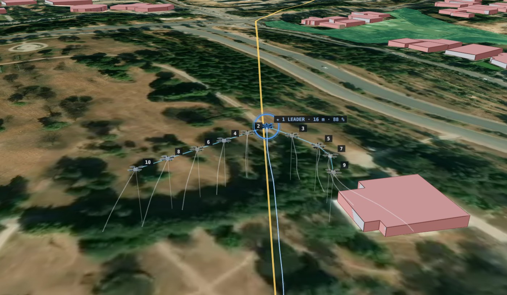

# Swarm Failover

**A drone swarm that keeps flying its mission when its leader fails, built and verified entirely in
simulation.** Ten PX4 quadrotors fly a V formation from home to a goal. When the leader crashes, loses
its radio or runs low on battery, the next drone takes over in about two seconds and the mission
continues. Every drone runs the same agent code and there is no central controller, so a drone can
later move to real Pixhawk 6C hardware by changing only its connection URL.



> **Scope and safety.** Simulation only. No code in this repository opens a serial port, connects to a
> real flight controller or flashes firmware, and no real drone has flown it. Payloads, targeting and
> anything that engages objects are out of scope.

## Highlights

All numbers come from logged simulation runs; each row names the report that holds the evidence.

| Area | Result | Evidence |
|---|---|---|
| Leader failover (fast simulator, 10 drones, 20 runs per fault type) | new leader agreed 1.64 s after the leader crashes or loses its radio (worst 1.75 s); planned low-battery handover in 0.17 s; goal reached in 100 of 100 runs | [docs/RESULTS.md](docs/RESULTS.md) |
| Leader election under random faults | exactly one leader after convergence in 1,000 of 1,000 randomized runs with crashes, radio loss, delays and network splits; median convergence 0.145 s | [reports/PHASE_2.md](reports/PHASE_2.md) |
| PX4 formation flight | 10 PX4 SIH drones with MAVROS fly a 1 km V mission in 6 of 6 runs; formation error at most 1.66 m (limit 2 m); closest pair at least 7.80 m (limit 5 m) | [reports/PHASE_3.md](reports/PHASE_3.md) |
| PX4 failover (Phase 4, 23 of 55 trials so far) | new leader 1.4–1.7 s after the leader is killed or loses its radio (limits: 3 s median, 4 s worst); planned handover under 0.01 s (limit 1 s); formation back within 6.6 s (13.4 s after a radio split heals); closest pair at least 6.03 m; goal reached 23/23 | [reports/PHASE_4.md](reports/PHASE_4.md) |
| Swarm size | 1 to 100 drones in the fast simulator; after the leader is killed, a new leader is agreed in 1.60–1.75 s (median) at every size from 2 to 100; heartbeat of 45 bytes for 10 drones and 56 bytes for 100 | [reports/SCALING.md](reports/SCALING.md) |
| Obstacle avoidance | on 90 unseen courses the learned policy with a brake completes 26/30 sparse and 18/30 medium courses, against 15/30 and 7/30 for the tuned classical controller | [docs/RESULTS.md](docs/RESULTS.md) |
| Real city map | 3.2 km across Islamabad among 932 OpenStreetMap buildings: no drone hit anything in 10 of 10 runs, including 5 in which the leader is killed halfway | [docs/RESULTS.md](docs/RESULTS.md) |
| Long routes | 12 km Islamabad to Rawalpindi with 2 charging stops: all 10 drones landed, no hits. Islamabad to Lahore (272.55 km, 65 stops): flown to the end, all 10 drones landed, no hits | [docs/RESULTS.md](docs/RESULTS.md) |
| Radio realism (fast simulator) | no false leader change in 180 missions with up to 300 ms delay and 30 % loss; the Phase 4 limits hold in 8 of 9 radio conditions | [reports/PHASE_5.md](reports/PHASE_5.md) |

## Project status (28 September 2026)

| Work package | Status | Report |
|---|---|---|
| Phase 0: environment audit, one PX4 drone | Passed | [reports/PHASE_0.md](reports/PHASE_0.md) |
| Phase 1: 10 PX4 drones on one laptop | Passed | [reports/PHASE_1.md](reports/PHASE_1.md) |
| Phase 2: agent logic, unit tests, 1,000 randomized fault runs | Passed | [reports/PHASE_2.md](reports/PHASE_2.md) |
| Phase 3: 10-drone PX4 formation flights | Passed | [reports/PHASE_3.md](reports/PHASE_3.md) |
| Scaling to 100 drones (fast simulator) | Passed | [reports/SCALING.md](reports/SCALING.md) |
| Obstacle avoidance: learned policy against a classical controller | First results | [docs/RESULTS.md](docs/RESULTS.md) |
| City-to-city routes with charging stops | Working; 12 km route completed end to end | [docs/RESULTS.md](docs/RESULTS.md) |
| Islamabad to Lahore run (272.55 km, 65 charging stops) | Completed on 28 September 2026: 10/10 drones landed, 0 hits | [docs/RESULTS.md](docs/RESULTS.md) |
| Ground-control app: 2-D map, 3-D view, fault injection, results, documents | Working | [docs/RUNBOOK.md](docs/RUNBOOK.md) |
| Phase 4: fault trials on PX4 | In progress: 23 of 55 trials done, every limit met; the rest run whenever the owner presses Start | [reports/PHASE_4.md](reports/PHASE_4.md) |
| Phase 5: radio realism sweep | Passed in the fast simulator; the PX4 sweep (18 missions) runs when the owner starts it | [reports/PHASE_5.md](reports/PHASE_5.md) |
| Phase 6: mixed-reality readiness and flight test plan | Software parts done (drone profiles, telemetry-radio stand-in, flight test plan); the PX4 stand-in test (22 trials) runs when the owner starts it | [reports/PHASE_6.md](reports/PHASE_6.md) |
| Formation shapes: line abreast, column, echelon | Added and compared; experimental, because only the V stays 5 m apart after faults | [docs/RESULTS.md](docs/RESULTS.md) |
| Long RL training on a Kaggle GPU | Kit ready and checked; not run | [docs/KAGGLE_GUIDE.md](docs/KAGGLE_GUIDE.md) |
| Real drones | Never flown | — |

The full history is in [CHANGELOG.md](CHANGELOG.md).

## How it works

```
        heartbeats, 5 per second, 45 bytes, between every pair of drones
        (in simulation through the link emulator: delay, loss, radio cut, network split)
    <----------------------------------------------------------------------------->
  +-----------------+      +-----------------+                 +-----------------+
  | swarm agent 1   |      | swarm agent 2   |       ...       | swarm agent N   |
  |  election       |      |  same code on   |                 |                 |
  |  mission, V slot|      |  every drone    |                 |                 |
  |  avoidance      |      |                 |                 |                 |
  |  safety layer   |      |                 |                 |                 |
  +--------+--------+      +--------+--------+                 +--------+--------+
           |  velocity setpoints 20 Hz;  position, velocity, battery back
  +--------+--------+      +--------+--------+                 +--------+--------+
  | MAVROS          |      | MAVROS          |                 | MAVROS          |
  +--------+--------+      +--------+--------+                 +--------+--------+
           |  MAVLink: UDP in simulation, serial on a real drone
  +--------+--------+      +--------+--------+                 +--------+--------+
  | PX4 autopilot   |      | PX4 autopilot   |                 | PX4 autopilot   |
  | (SIH simulator) |      | (SIH simulator) |                 | (SIH simulator) |
  +-----------------+      +-----------------+                 +-----------------+
```

- **No central controller.** Every drone runs the same agent and decides its own role from the
  heartbeats it hears. The lowest-numbered healthy drone leads; a term counter settles conflicts, so
  after a network split heals there is exactly one leader again.
- **Failover.** If nobody hears the leader for 1.5 s, the next eligible drone takes over. At 30 %
  battery the leader hands over on purpose, leaves the formation and flies home.
- **Formation.** A V with 10 m between neighbours. Each follower copies the leader's velocity and
  corrects toward its slot; when a drone is lost, the drones behind it on the same arm move up. Line
  abreast, column and echelon are available as experimental options.
- **Safety layer.** A hard 5 m minimum distance between drones (repulsion starts at 7.5 m), a
  geofence around home, and an emergency landing on GPS loss or at 10 % battery.
- **One shared frame.** Each drone converts its GPS position to one East-North-Up frame; the MAVROS
  local frames, which start wherever each drone powered on, are never compared.
- **Obstacles.** The leader plans its route around buildings (A* search over OpenStreetMap footprints); the
  followers avoid obstacles with a learned policy (PPO, a 47-128-128-2 network run with numpy only)
  or a classical potential field, with a stopping-distance brake on top.

Details: [docs/ARCHITECTURE.md](docs/ARCHITECTURE.md). The reasons behind each design choice:
[docs/DECISIONS.md](docs/DECISIONS.md).

## Getting started

Requirements: Ubuntu 24.04 with Python 3.12. The PX4 flights also need ROS 2 Jazzy, MAVROS and PX4
v1.18.0-rc1; the full installation is in [docs/RUNBOOK.md](docs/RUNBOOK.md), section 1.

```bash
git clone https://github.com/saad-rafeque/drone-swarm-failover.git
cd drone-swarm-failover
sudo apt install python3-numpy python3-scipy python3-matplotlib python3-yaml python3-psutil python3-pytest python3-pytest-cov
python3 -m pytest          # the unit and integration tests; tests that need ROS 2 or PyTorch are skipped
python3 scripts/gcs.py     # the ground-control app; then open http://localhost:8080
```

The ground-control app has five pages: **Mission** (2-D map, mission setup, fault buttons), **3D view**
(3-D drones over terrain and buildings, chase, orbit and top cameras), **Results**, **PX4 flights**
(replay of the logged PX4 runs) and **Docs**. Satellite imagery and the 3-D view need your own Mapbox
and Cesium ion tokens: copy `config/map_keys.example.yaml` to `config/map_keys.local.yaml` and paste
them there. That file is ignored by git, so the keys never leave your computer.

One-click start on the development laptop: run `bash scripts/install_launcher.sh` once, then
double-click **Swarm Control** in the project folder or on the desktop (or run
`./start_swarm_control.sh`). Stop the app with `scripts/stop_swarm.sh`.

PX4 flights, fault trials, RL training and every other experiment: [docs/RUNBOOK.md](docs/RUNBOOK.md).

## Repository layout

```
drone-swarm-failover/
├── src/
│   ├── swarm_agent/        onboard agent: election, formation, safety, geometry, heartbeat,
│   │                       obstacles, route planner, avoiders, ROS 2 node
│   └── swarm_tools/        simulation and test tooling: PX4/MAVROS launcher, link emulator,
│                           logger, fast simulators, OpenStreetMap loader, ground-control app
├── config/                 swarm.yaml (every tunable), MAVROS plugin list, map-key template
├── launch/                 ROS 2 launch file: link emulator, logger, one agent per drone
├── scripts/                entry points: flights, fault trials, evaluations, training, plots, documents
├── tests/                  pytest suite
├── models/                 trained obstacle-avoidance policy (numpy weights)
├── data/                   cached OpenStreetMap map data (ODbL)
├── kaggle/                 notebook for long RL training on a Kaggle GPU
├── docs/                   specification, architecture, runbook, results, decisions, known issues, guides, PDFs
├── reports/                phase reports, figures and the raw evidence logs
├── start_swarm_control.sh  one-click start of the ground-control app
└── CHANGELOG.md            project history by milestone
```

Every folder has its own README describing its contents.

## Documentation

| Document | What it covers |
|---|---|
| [docs/SPECIFICATION.md](docs/SPECIFICATION.md) | The original project specification: goals, hard rules, phases and acceptance criteria |
| [docs/ARCHITECTURE.md](docs/ARCHITECTURE.md) | How the system works, from one drone outwards |
| [docs/RUNBOOK.md](docs/RUNBOOK.md) | Installation from scratch and the command for every test, experiment and document |
| [docs/RESULTS.md](docs/RESULTS.md) | Every result with its numbers and the evidence file behind it |
| [docs/DECISIONS.md](docs/DECISIONS.md) | The design decisions and the reasons for them |
| [docs/KNOWN_ISSUES.md](docs/KNOWN_ISSUES.md) | Limitations, open work and the road to real drones |
| [docs/FLIGHT_TEST_PLAN.md](docs/FLIGHT_TEST_PLAN.md) | The plan for a first test with one real drone: roles, PX4 safety settings, go/no-go checklist, abort rules, kill switch |
| [docs/KAGGLE_GUIDE.md](docs/KAGGLE_GUIDE.md) | Long RL training on a Kaggle GPU, step by step (also as `docs/KAGGLE_GUIDE.pdf`) |
| [docs/HANDOVER.pdf](docs/HANDOVER.pdf) | All documents, the key figures and every phase report in one PDF |
| [reports/README.md](reports/README.md) | Phase reports, figures and the raw logs they were computed from |
| [CHANGELOG.md](CHANGELOG.md) | What was done, and when |

## Technology

Ubuntu 24.04.5, ROS 2 Jazzy, PX4 v1.18.0-rc1 (`fca3df865a`, target `px4_sitl_sih`), MAVROS 2.15.1,
Python 3.12.3, numpy 1.26.4, scipy 1.11.4. Reinforcement learning: PyTorch 2.14.0 (CPU),
Stable-Baselines3 2.9.0, Gymnasium 1.3.0. Ground-control app: Python standard-library HTTP server,
Leaflet and CesiumJS 1.145 in the browser. Development machine: Intel i3-1115G4 (2 cores, 4 threads),
8 GB RAM, no GPU.

## Roadmap

1. Finish the PX4 tests (72 trials, about 7 hours): press Start on the PX4 tests page of the app whenever it
   suits, and Stop at any time; finished trials are kept.
2. Long RL training on a Kaggle GPU with several seeds.
3. Keep drones apart when they cannot hear each other; give followers a way out of dead ends at buildings;
   slot-change rules that make the line, column and echelon as safe as the V.
4. Real drones: a companion computer on every Pixhawk 6C, a radio bridge for the heartbeats, a stable PX4
   release, bench tests, then the first flight by [docs/FLIGHT_TEST_PLAN.md](docs/FLIGHT_TEST_PLAN.md), after
   legal permission.

The complete list with evidence and effort estimates: [docs/KNOWN_ISSUES.md](docs/KNOWN_ISSUES.md).

## Credits and licence

PX4 Autopilot, MAVROS and ROS 2 are used as published by their projects and are not part of this
repository. Map data © OpenStreetMap contributors (ODbL). Satellite imagery © Mapbox, © Maxar, or Esri
World Imagery. 3-D terrain, buildings and photorealistic tiles through Cesium ion. Every result comes
from logged runs in `reports/`.

This is a private repository. No licence has been chosen yet, so all rights are reserved by the owner.
