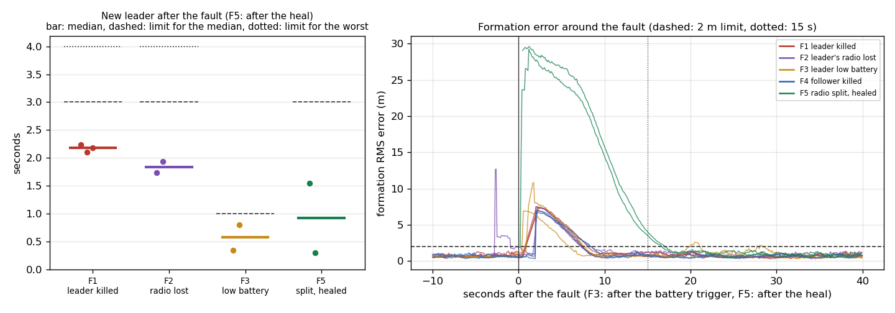

# Phase 4 — Failover under faults
Status: NOT COMPLETED — stopped by the owner on 27 September 2026 because this laptop cannot run the
55-trial PX4 batch reliably. The tools are ready and checked; this report says what was measured so
far (indicative only), why the runs were stopped, and exactly how to run Phase 4 later.

> **In short.** In Phase 4, ten PX4 drones fly the mission while one of five faults is injected (leader
> killed, leader's radio lost, leader's battery low, a follower killed, radio network split). Each fault
> had to be run 10 times (about 7 hours). The first attempt ran on battery (power-saver mode, CPU at
> 100 %) until the battery ran out; the second, on the charger, still overloaded the laptop and was
> stopped by the owner. So far: a new leader takes over in about 1.6–2.2 s (limit 3 s), the planned
> battery handover in 0.35–0.80 s (limit 1 s), and no two drones came closer than 5 m. Only F5 (after the
> radio split heals) needed about 17 s to re-form (limit 15 s). How to run it later is in
> "How to run Phase 4 later" below.

## What Phase 4 must show (`docs/SPECIFICATION.md`, section 7)
Faults, each at a random time during cruise, 10 trials each, 10 drones:
- F1 master killed (its PX4 + MAVROS processes killed)
- F2 master link lost (the link emulator drops 100 % of the master's heartbeats)
- F3 master low battery (PX4's simulated battery if verifiable, else injected at the agent level)
- F4 follower killed
- F5 partition then heal (two groups, then reconnect)

Acceptance:
- F1/F2: new master heartbeat within 3.0 s median (4.0 s worst case) of the failure.
- F3: planned handover within 1.0 s of the trigger; the old master leaves and returns home.
- F4: no master change; the formation recovers.
- F5: a single master within 3.0 s after the heal.
- All: formation RMS back under 2 m within 15 s; minimum separation never below 5 m; goal reached in
  at least 9 of 10 trials per fault.
- Report table per fault: median / worst handover time, recovery time, minimum separation, success rate.

## Acceptance criteria
None of them can be marked PASS or FAIL: the required 10 valid trials per fault were not run. What the
partial runs indicate (conditions below):
- [NOT MEASURED] F1/F2 handover — indicative: 1.62–2.23 s in all 6 F1/F2 trials (limit 3.0 / 4.0 s).
- [NOT MEASURED] F3 planned handover — indicative: 0.35 and 0.80 s (limit 1.0 s); the old master landed
  at home both times.
- [NOT MEASURED] F4 no master change — indicative: 2 of 2 without a change; formation back in 7.4–8.5 s.
- [NOT MEASURED] F5 single master after the heal — indicative: 0.30 and 1.55 s (limit 3.0 s).
- [NOT MEASURED] Formation under 2 m within 15 s — indicative: yes for F1–F4 (5.7–8.5 s); **no for F5**
  (16.7 and 17.1 s, see "Why F5 is slow").
- [NOT MEASURED] Minimum separation >= 5 m — indicative: 6.11 m or more in every trial.
- [NOT MEASURED] Goal reached >= 9/10 per fault — indicative: every trial that ran to the end reached
  the goal (10 of 10).

## What happened (27 September 2026)

| Time | What | Outcome |
|---|---|---|
| 12:31–13:57 | First attempt: rounds 1–3 of F1–F5 | The laptop was on battery in the power-saver profile (CPU about 1.7 GHz instead of up to 4.1 GHz). With 10 drones the CPU was at 99.9 % for the whole run (load average about 60; Phase 3 ran at about 17 and 67 % CPU on the charger). 10 trials completed; F1_t3 stopped when the whole machine stalled for 18 s; the battery ran out at 13:57 (the system log ends without a shutdown) and cut F2_t3 off. Kept apart: `reports/logs/phase_4_on_battery/` (README there). |
| 14:26 | Batch restarted with a charger check | It waited for the charger and a non-power-saver profile. |
| 14:50 | Charger connected, Performance profile | The first trial started with a wrong fault name (a variable clash in the new charger check) and stopped at once; fixed in `a31f1f0`. |
| 14:52–14:57 | Second attempt, on the charger | F1 trial 1 flew: new leader after 1.62 s, formation back under 2 m after 5.71 s, closest pair 7.90 m. The load average still rose from 19 to about 40. |
| 14:58 | Stopped by the owner | "This laptop can't handle it." The trial was in the hover at the goal, not yet landed. `reports/logs/phase_4/F1_t1/`. |

## Key numbers so far (indicative only)
First attempt, on battery with a saturated CPU (`reports/logs/phase_4_on_battery/phase4_on_battery_table.md`,
made by `scripts/phase4_metrics.py` from the trial logs):

| Fault | Trials | New leader median / worst (s) | Limit (s) | Formation < 2 m median / worst (s) | Recovered within 15 s | Closest pair (m) | Goal reached | Other |
|---|---|---|---|---|---|---|---|---|
| F1 | 3 | 2.19 / 2.23 | 3.0 / 4.0 | 7.54 / 8.11 | 3/3 | 7.41 | 2/3 (F1_t3 stopped by the machine stall) |  |
| F2 | 2 | 1.84 / 1.94 | 3.0 / 4.0 | 7.92 / 8.51 | 2/2 | 8.00 | 2/2 |  |
| F3 | 2 | 0.57 / 0.80 | 1.0 | 6.88 / 7.78 | 2/2 | 7.17 | 2/2 | old leader landed at home: 2/2 |
| F4 | 2 | no change | no change | 7.90 / 8.45 | 2/2 | 7.96 | 2/2 | leader changed: 0/2 |
| F5 | 2 | 0.93 / 1.55 | 3.0 (after the heal) | 16.89 / 17.08 | 0/2 | 6.11 | 2/2 |  |

Second attempt, on the charger (`reports/logs/phase_4/phase4_stopped_table.json`): F1 trial 1 — new
leader 1.62 s, formation back 5.71 s, closest pair 7.90 m, reached the goal hover. The same fault with
the same seed on battery took 2.23 s and 7.54 s: the power-saver CPU made everything slower.

Per-trial rows, including a short 0.4 s formation-error spike in F4_t1 (a late message under the
saturated CPU) and the 18 s stall in F1_t3: `reports/logs/phase_4_on_battery/phase4_on_battery_table.md`.
Figure: `reports/phase4_on_battery.png` (takeover times against the limits; formation error around each
fault).



## Why F5 is slow, and the options (the owner decides)
The front group (drones 1–5) and the back group (6–10) are split for 10–20 s. The back group elects
drone 6 (term 2). After the heal, drone 1 (term 1) hears a master with a higher term and steps down,
exactly as `docs/SPECIFICATION.md` section 6 prescribes, so **all ten drones re-form around drone 6**. Timeline of
F5_t1 after the heal (from `states.jsonl`): every follower is 20–32 m from its new slot; each moves on
the "transit layer" (drops about 6 m below the formation, crosses, climbs back) so paths cannot cross
at the same height. PX4 descends at about 1.5 m/s and the drones climb at 2 m/s, so: about 7 s
descending (with little sideways progress: the drones only move sideways slowly until they are 5 m
below), about 6 s crossing, about 4–5 s climbing back. The height offset counts in the 3-D formation
error, so the error only falls under 2 m after the climb: about 17 s in total. In the fast simulator
(faster vertical response) the same fault recovered in about 10 s.

Options (none applied):
1. Keep the rules; make the move faster: allow sideways motion from half the transit depth, and/or a
   faster descent limit (PX4 `MPC_Z_VEL_MAX_DN` and `mission.descent_rate_mps`). Expected: 3–5 s less;
   smaller vertical margin during the move.
2. After a merge, hand the lead back to the lowest ID with the existing planned handover (0.35–0.80 s
   in F3), so only the back group re-slots. Changes the election behaviour written in `docs/SPECIFICATION.md`,
   so it needs the owner's approval.
3. Accept a longer limit for F5 (for example 20 s).

## How to run Phase 4 later
### What the computer needs
- **A stronger computer is recommended.** On this laptop (Intel i3-1115G4, 2 cores / 4 threads, 8 GB)
  10 PX4 drones + 10 MAVROS + 10 agents load the CPU to 60–100 % even on the charger; on battery the
  CPU saturates. A machine with 8 or more cores and 16 GB (a desktop or a cloud VM) with the same setup
  (`docs/RUNBOOK.md`, section 1: Ubuntu 24.04, ROS 2 Jazzy, MAVROS 2.15.1, PX4 v1.18.0-rc1 built with
  `scripts/build_px4.sh`) runs it comfortably.
- **Or on this laptop with fewer drones:** `N=5 bash scripts/phase4_all.sh 1`. `docs/SPECIFICATION.md` rule 6
  allows reducing the drone count; say so in the report.
- Always: on the charger, power mode Balanced or Performance (the batch waits otherwise), lid open,
  at least 800 MB free memory (`free -m`; `run_mission.py` refuses to start below that), and the
  Swarm Control app, the 3-D view and other heavy programs closed.

### Commands (from the repository root)
```bash
bash scripts/phase4_all.sh 1      # rounds 1-10 of F1-F5, then round 11 from a clean shell as the cross-check
```
About 8 minutes per trial: 50 trials plus 5 cross-check trials, about 7 hours. If it is stopped, run the
same command again: finished trials are skipped. To check the plan without flying:
`DRY_RUN=1 bash scripts/phase4_runs.sh 1 2 dry_test` (then delete `reports/logs/dry_test`).

After the batch:
```bash
python3 scripts/phase4_metrics.py --out reports/logs/phase_4/phase4_table.json --md reports/logs/phase_4/phase4_table.md reports/logs/phase_4/F?_t*
python3 scripts/phase4_metrics.py --out reports/logs/phase_4_crosscheck/phase4_table.json --md reports/logs/phase_4_crosscheck/phase4_table.md reports/logs/phase_4_crosscheck/F?_t*
python3 scripts/plot_phase4.py reports/logs/phase_4/phase4_table.json --out reports/phase4_faults.png
```
Then rewrite this report: the per-fault table from `phase4_table.md`, every acceptance line marked PASS
or FAIL with its number and file, the cross-check round compared, commit, and tag `phase-4` if it passed.

> **Checklist for later.** (1) Use a stronger computer (8 or more cores, 16 GB), or this laptop with
> 5 drones. (2) Charger in, power mode Balanced or Performance, lid open, the 3-D view and other heavy
> programs closed. (3) Run `bash scripts/phase4_all.sh 1` (5 drones: `N=5 bash scripts/phase4_all.sh 1`);
> about 7 hours. If it stops, run the same command again: finished trials are skipped. (4) Afterwards run
> the `phase4_metrics.py` and `plot_phase4.py` commands above and rewrite this report with PASS/FAIL.

### What each trial writes (`reports/logs/phase_4/F<k>_t<round>/`)

| File | Contents |
|---|---|
| `states.jsonl.gz` | every drone's state 10 times a second: position, velocity, role, term, phase, battery, `claim_t` (when it became master), `retire_t` (when its battery handover started) |
| `fault_events.jsonl` | cruise detected, the fault (time, master before, target), the heal (F5) |
| `link_events.jsonl` | link-emulator commands (block the master's radio, split, heal) |
| `metrics.json`, `formation_rms.csv` | from `scripts/metrics.py`: formation error, closest pair, leader changes, where every drone landed |
| `run_summary.json` | result (COMPLETED / TIMEOUT / WATCHER_STALLED / ERROR), memory, power state before and after, CPU and memory use |
| `resources.csv` | CPU and memory once a second, per process group |
| `proc_logs/` | PX4, MAVROS and launch console logs |
| `../F<k>_t<round>.out` | the trial's console output |

### How each number is measured (`scripts/phase4_metrics.py`)
- The fault time is when the injector started the fault (before the kill commands ran), so the kill
  time counts against the result.
- F1/F2 handover: fault → the first `claim_t` of another drone (a new master sends its heartbeat in the
  same control step in which it claims).
- F3 handover: the old master's `retire_t` (battery at 30 %) → the successor's `claim_t`; "home": the old
  master landed within 5 m of its home.
- F5: the heal → the first moment every live drone follows one single master.
- Formation recovery: from the fault (F3: the battery trigger; F5: the heal), measured from the worst
  formation error in the next 30 s, until the RMS is under 2 m and stays there for 5 s.
- Minimum separation and "goal reached": `scripts/metrics.py` (3-D distance between airborne drones;
  every drone still reporting at the end landed in its slot at the goal, a retired one at home).

### How the faults are made (`scripts/faults.py`)
Each fault fires at a seeded random time 30–150 s after the master first reports CRUISE (the batch uses
the round number as the seed, so a round can be repeated exactly).
- F1 / F4: SIGKILL the drone's PX4 and MAVROS process groups, then its agent process.
- F2: the link emulator blocks every heartbeat the master sends, until the end of the run.
- F3: `px4-param --instance <n> set SIM_BAT_MIN_PCT 20` on the master's PX4. PX4's battery simulator
  drains the battery while armed (full discharge in `SIM_BAT_DRAIN` = 60 s) down to `SIM_BAT_MIN_PCT`
  (default 50 %); at 20 % it passes our 30 % handover level about 20 s later.
- F5: the link emulator splits IDs 1–5 from 6–10 (the front and the back of the V, as distance would),
  and heals after a random 10–20 s.

### Files that make up Phase 4

| File | Role |
|---|---|
| `scripts/phase4_all.sh` | the whole batch: rounds 1–10, then the clean-shell cross-check round 11 |
| `scripts/phase4_runs.sh` | one or more rounds of F1–F5; waits for the charger; skips finished trials; `DRY_RUN` |
| `scripts/run_mission.py` | one mission: checks memory and power, starts PX4 + MAVROS, the ROS 2 launch, injects the fault, waits for the landing, computes the metrics |
| `scripts/faults.py` | the five faults |
| `scripts/phase4_metrics.py` | per-trial and per-fault numbers, JSON and Markdown tables |
| `scripts/plot_phase4.py` | the figure |
| `scripts/metrics.py` | formation error, separation, goal, per run |
| `src/swarm_tools/sim_launch.py` | PX4 SIH and MAVROS instances, kill a drone |
| `src/swarm_tools/link_emulator.py` | heartbeat forwarding with block, split and heal commands |
| `src/swarm_tools/logger_node.py` | writes `states.jsonl` |
| `src/swarm_tools/resources.py` | CPU / memory sampler and `power_state()` |
| `src/swarm_agent/ros_node.py` | the drone agent; publishes `claim_t` and `retire_t` |
| `launch/swarm.launch.py` | link emulator, logger and one agent per drone |
| `config/swarm.yaml` | every setting (spacing, speeds, handover at 30 %, heartbeat 5 Hz, dead after 1.5 s, transit layer) |

## Sources verified (commands / files)
- PX4 battery simulator (installed PX4 v1.18.0-rc1, `~/PX4-Autopilot`):
  `src/modules/simulation/battery_simulator/battery_simulator_params.yaml` (`SIM_BAT_DRAIN` default 60 s,
  full discharge while armed; `SIM_BAT_MIN_PCT` default 50 %, "can be used to alter the battery level
  during SITL simulation on the fly"); `BatterySimulator.cpp` (drains only while armed, back to 100 %
  when disarmed); `ROMFS/px4fmu_common/init.d-posix/rcS` (`battery_simulator start` when
  `SIM_BAT_DRAIN` > 0). Seen working: `px4_param_out` "SIM_BAT_MIN_PCT: curr: 50.0000 -> new: 20.0000"
  in every F3 trial's `fault_events.jsonl`.
- PX4 shell client instance selection: `platforms/posix/src/px4/common/main.cpp` (`--instance <n>` must
  be the first argument); instance = drone id − 1 (`src/swarm_tools/sim_launch.py`, `instance_of`).
- Power state: `/sys/class/power_supply/*` (type, online, capacity, status), `powerprofilesctl get`,
  `/proc/cpuinfo`; the previous boot's end without a shutdown: `journalctl --list-boots`, `journalctl -b -1`.

## Problems found and fixed
- The agents did not publish when they became master or started a battery handover, so no takeover
  time could be measured: `ros_node.py` now publishes `claim_t` and `retire_t` (`8252d4c`).
- The fault time was taken after the kill commands had run (about 0.7 s later), which made takeovers
  look faster: it is now the moment the fault started.
- F3 formation recovery was counted from the parameter change, about 20 s before the formation was
  disturbed: it now counts from the battery trigger, and every recovery from the worst error after the
  reference.
- Trials on battery saturate the CPU: the batch now waits for the charger and a Balanced/Performance
  profile, and every trial records its power state (`94a1148`); a variable clash in that check was
  fixed (`a31f1f0`).
- 16 MB of state log per trial: compressed after each trial (about 1.5 MB); the metric scripts read
  the compressed files.

## Known limitations / honest caveats
- No valid 10-trial set exists: all numbers above are indicative. Of the 12 trials with results, 11 ran
  on battery with a saturated CPU (10 to the end, 1 stopped by the stall), which made takeovers and
  recovery slower (compare the charger trial); the 12th ran on the charger and was stopped in the hover
  at the goal.
- Two trials per fault cannot show a median or a worst case; F5's 17 s is consistent across both
  trials and explained by the transit layer, so it is likely to fail the 15 s limit as the system stands.
- The earlier Phase 3 harness stall came back once (F1_t3), this time caused by the whole machine
  stalling on battery, not by the harness.

## Next phase: what is needed from the owner
1. Decide where to run Phase 4: a stronger computer (recommended), or this laptop with 5 drones.
2. Decide how F5 should be handled (options 1–3 above).
3. Phase 5 (radio realism: 50/150/300 ms × 0/10/30 % loss) and Phase 6 build on Phase 4 and have the
   same computing needs.
