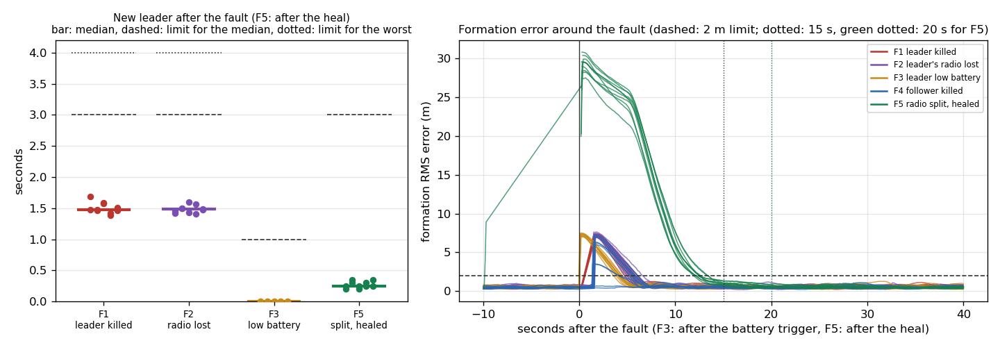

# Phase 4 — Failover under faults
Status: PASSED — 50 trials (10 per fault) and a 5-trial cross-check round from a clean shell, 10 PX4 drones,
28 September 2026. Every acceptance criterion holds in every trial.

> **In short.** Ten PX4 drones flew the mission while one of five faults was injected: the leader killed,
> the leader's radio lost, the leader's battery low, a follower killed, the radio network split. Each fault
> ran 10 times, plus once more from a clean shell.
> - After the leader was killed or lost its radio, a new leader took over in 1.4–1.7 s (limits: 3 s median,
>   4 s worst).
> - The planned battery handover took at most 0.01 s (limit 1 s), and the old leader flew home every time.
> - Killing a follower never changed the leader.
> - After a split healed, one leader remained within 0.35 s (limit 3 s).
> - The formation was back within 6.6 s (limit 15 s), or 13.4 s after a split (limit 20 s).
> - No two drones came closer than 6.03 m (limit 5 m), and every mission reached its goal (55 of 55).

## Acceptance criteria
Rounds 1–10 (`reports/logs/phase_4/phase4_table.md`) and the cross-check round 11 from a clean shell
(`reports/logs/phase_4_crosscheck/phase4_table.md`), both made by `scripts/phase4_metrics.py` from the
trial logs.
- [PASS] F1/F2: new master heartbeat within 3.0 s median, 4.0 s worst.
  - F1: 1.48 / 1.69 s; F2: 1.48 / 1.60 s (rounds 1–10).
  - Cross-check: F1 1.41 s, F2 1.60 s.
- [PASS] F3: planned handover within 1.0 s of the trigger, and the old master leaves and returns home.
  - 0.00 / 0.01 s (median / worst); cross-check 0.00 s.
  - The old leader landed at home in 10 of 10, and 1 of 1 in the cross-check.
- [PASS] F4: no master change, and the formation recovers.
  - Leader changed in 0 of 10 and 0 of 1.
  - Formation back within 6.18 s at worst.
- [PASS] F5: a single master within 3.0 s after the heal.
  - 0.25 / 0.35 s (median / worst); cross-check 0.10 s.
- [PASS] All: formation RMS back under 2 m within 15 s (F5: 20 s, the owner's decision of 28 September 2026).
  - F1–F4: at most 6.60 s. F5: at most 13.44 s.
  - Every trial recovered within its limit: 55 of 55.
- [PASS] All: minimum separation never below 5 m.
  - The closest pair in any trial was 6.03 m (F5_t1).
- [PASS] All: goal reached in at least 9 of 10 trials per fault.
  - 10 of 10 for every fault, and 5 of 5 in the cross-check.
- [PASS] Report table per fault: below.

## Key numbers
Rounds 1–10 (`reports/logs/phase_4/phase4_table.md`, per-trial rows there):

| Fault | Trials | New leader median / worst (s) | Limit (s) | Formation < 2 m median / worst (s) | Recovered within limit (15 s; F5: 20 s) | Closest pair (m) | Goal reached | Other |
|---|---|---|---|---|---|---|---|---|
| F1 | 10 | 1.48 / 1.69 | 3.0 / 4.0 | 5.54 / 6.14 | 10/10 | 8.04 | 10/10 |  |
| F2 | 10 | 1.48 / 1.60 | 3.0 / 4.0 | 5.75 / 6.60 | 10/10 | 7.58 | 10/10 |  |
| F3 | 10 | 0.00 / 0.01 | 1.0 | 4.20 / 4.50 | 10/10 | 7.05 | 10/10 | old leader landed at home: 10/10 |
| F4 | 10 | no change | no change | 5.28 / 6.18 | 10/10 | 6.88 | 10/10 | leader changed: 0/10 |
| F5 | 10 | 0.25 / 0.35 | 3.0 (after heal) | 12.52 / 13.44 | 10/10 | 6.03 | 10/10 |  |

Cross-check, round 11 from a clean shell (`reports/logs/phase_4_crosscheck/`; every simulator process was stopped
before it):

| Fault | New leader (s) | Formation < 2 m (s) | Closest pair (m) | Goal |
|---|---|---|---|---|
| F1 | 1.41 | 5.48 | 8.06 | yes |
| F2 | 1.60 | 5.75 | 8.09 | yes |
| F3 | 0.00 (old leader home: yes) | 3.75 | 8.55 | yes |
| F4 | no change | 0.01 | 8.54 | yes |
| F5 | 0.10 | 12.47 | 6.05 | yes |

## How the trials ran (28 September 2026)
- **One trial at a time:** the PX4 test queue (`scripts/px4_queue.py`, the "PX4 tests" page of the
  ground-control app, removed on 29 September 2026 once all trials had finished) ran them, started and stopped by the owner. Its log is `reports/logs/px4_queue/runner.log`.
- **Power:** 40 trials ran on the charger. 15 ran on battery, which the owner allows: F1–F5 round 10, F1–F3
  round 7, F3–F5 rounds 6 and 7, and the F1 and F2 cross-checks (`run_summary.json`, `power_before`). They
  passed like the others; for example F1_t7 and F1_t10 took 1.58 and 1.47 s. The first attempt on
  27 September had failed on battery in the power-saver profile; this time the profile was Balanced.
- **Interrupted attempts:**
  - Trials cut off when the charger was unplugged were discarded and flown again from the start.
  - One attempt of the F4 cross-check stopped when the mission watcher stalled (a tooling fault, not a flight
    result). It is kept in `reports/logs/phase_4_incomplete/`, and the trial then ran again and passed.
- **Earlier attempts on 27 September 2026, not used for acceptance:**
  - `reports/logs/phase_4_on_battery/`: 12 trials on battery in the power-saver profile, with the CPU
    saturated.
  - `reports/logs/phase_4_stopped/`: one trial on the charger, stopped by the owner.
  - They were slower (for example F1 2.2 s instead of 1.5 s) but within the limits, except F5's 17 s against
    the original 15 s limit.

## Why F5 takes longer, and the owner's decision
The front group (drones 1–5) and the back group (6–10) are split for 10–20 s. The back group elects
drone 6 (term 2). After the heal, drone 1 (term 1) hears a master with a higher term and steps down,
exactly as `docs/SPECIFICATION.md` section 6 prescribes, so **all ten drones re-form around drone 6**. Timeline of
F5_t1 of the first attempt (27 September, on battery with a slowed CPU; `states.jsonl`) after the heal: every follower is 20–32 m from its new slot; each moves on
the "transit layer" (drops about 6 m below the formation, crosses, climbs back) so paths cannot cross
at the same height. PX4 descends at about 1.5 m/s and the drones climb at 2 m/s, so: about 7 s
descending (with little sideways progress: the drones only move sideways slowly until they are 5 m
below), about 6 s crossing, about 4–5 s climbing back. The height offset counts in the 3-D formation
error, so the error only falls under 2 m after the climb: about 17 s in total. On the charger on
28 September the same sequence took 12.5 s (median; worst 13.4 s). In the fast simulator (faster vertical
response) it took about 10 s.

Options considered:
1. Keep the rules; make the move faster: allow sideways motion from half the transit depth, and/or a
   faster descent limit (PX4 `MPC_Z_VEL_MAX_DN` and `mission.descent_rate_mps`). Expected: 3–5 s less;
   smaller vertical margin during the move.
2. After a merge, hand the lead back to the lowest ID with the existing planned handover (0.35–0.80 s
   in F3), so only the back group re-slots. Changes the election behaviour written in `docs/SPECIFICATION.md`,
   so it needs the owner's approval.
3. Accept a longer limit for F5 (for example 20 s).

**Decision (28 September 2026): option 3.** The owner set the F5 formation-recovery limit to 20 s and kept
the election rule and the transit layer unchanged. `scripts/phase4_metrics.py` and `scripts/plot_phase4.py`
use 20 s for F5 and 15 s for the other faults.

## What each trial writes (`reports/logs/phase_4/F<k>_t<round>/`)

| File | Contents |
|---|---|
| `states.jsonl.gz` | every drone's state 10 times a second: position, velocity, role, term, phase, battery, `claim_t` (when it became master), `retire_t` (when its battery handover started) |
| `fault_events.jsonl` | cruise detected, the fault (time, master before, target), the heal (F5) |
| `link_events.jsonl` | link-emulator commands (block the master's radio, split, heal) |
| `metrics.json`, `formation_rms.csv` | from `scripts/metrics.py`: formation error, closest pair, leader changes, where every drone landed |
| `run_summary.json` | result (COMPLETED / TIMEOUT / WATCHER_STALLED / ERROR), memory, power state before and after, CPU and memory use |
| `resources.csv` | CPU and memory once a second, per process group |
| `proc_logs/` | PX4, MAVROS and launch console logs |
| `../F<k>_t<round>.out` | the trial's console output |

## How each number is measured (`scripts/phase4_metrics.py`)
- The fault time is when the injector started the fault (before the kill commands ran), so the kill
  time counts against the result.
- F1/F2 handover: fault → the first `claim_t` of another drone (a new master sends its heartbeat in the
  same control step in which it claims).
- F3 handover: the old master's `retire_t` (battery at 30 %) → the successor's `claim_t`; "home": the old
  master landed within 5 m of its home.
- F5: the heal → the first moment every live drone follows one single master.
- Formation recovery: from the fault (F3: the battery trigger; F5: the heal), measured from the worst
  formation error in the next 30 s, until the RMS is under 2 m and stays there for 5 s.
- Minimum separation and "goal reached": `scripts/metrics.py` (3-D distance between airborne drones;
  every drone still reporting at the end landed in its slot at the goal, a retired one at home).

## How the faults are made (`scripts/faults.py`)
Each fault fires at a seeded random time 30–150 s after the master first reports CRUISE (the batch uses
the round number as the seed, so a round can be repeated exactly).
- F1 / F4: SIGKILL the drone's PX4 and MAVROS process groups, then its agent process.
- F2: the link emulator blocks every heartbeat the master sends, until the end of the run.
- F3: `px4-param --instance <n> set SIM_BAT_MIN_PCT 20` on the master's PX4. PX4's battery simulator
  drains the battery while armed (full discharge in `SIM_BAT_DRAIN` = 60 s) down to `SIM_BAT_MIN_PCT`
  (default 50 %); at 20 % it passes our 30 % handover level about 20 s later.
- F5: the link emulator splits IDs 1–5 from 6–10 (the front and the back of the V, as distance would),
  and heals after a random 10–20 s.

## Files that make up Phase 4

| File | Role |
|---|---|
| `scripts/phase4_all.sh` | the whole batch: rounds 1–10, then the clean-shell cross-check round 11 |
| `scripts/phase4_runs.sh` | one or more rounds of F1–F5; waits for the charger; skips finished trials; `DRY_RUN` |
| `scripts/run_mission.py` | one mission: checks memory and power, starts PX4 + MAVROS, the ROS 2 launch, injects the fault, waits for the landing, computes the metrics |
| `scripts/faults.py` | the five faults |
| `scripts/phase4_metrics.py` | per-trial and per-fault numbers, JSON and Markdown tables |
| `scripts/plot_phase4.py` | the figure |
| `scripts/metrics.py` | formation error, separation, goal, per run |
| `src/swarm_tools/sim_launch.py` | PX4 SIH and MAVROS instances, kill a drone |
| `src/swarm_tools/link_emulator.py` | heartbeat forwarding with block, split and heal commands |
| `src/swarm_tools/logger_node.py` | writes `states.jsonl` |
| `src/swarm_tools/resources.py` | CPU / memory sampler and `power_state()` |
| `src/swarm_agent/ros_node.py` | the drone agent; publishes `claim_t` and `retire_t` |
| `launch/swarm.launch.py` | link emulator, logger and one agent per drone |
| `config/swarm.yaml` | every setting (spacing, speeds, handover at 30 %, heartbeat 5 Hz, dead after 1.5 s, transit layer) |

## Sources verified (commands / files)
- PX4 battery simulator (installed PX4 v1.18.0-rc1, `~/PX4-Autopilot`):
  `src/modules/simulation/battery_simulator/battery_simulator_params.yaml` (`SIM_BAT_DRAIN` default 60 s,
  full discharge while armed; `SIM_BAT_MIN_PCT` default 50 %, "can be used to alter the battery level
  during SITL simulation on the fly"); `BatterySimulator.cpp` (drains only while armed, back to 100 %
  when disarmed); `ROMFS/px4fmu_common/init.d-posix/rcS` (`battery_simulator start` when
  `SIM_BAT_DRAIN` > 0). Seen working: `px4_param_out` "SIM_BAT_MIN_PCT: curr: 50.0000 -> new: 20.0000"
  in every F3 trial's `fault_events.jsonl`.
- PX4 shell client instance selection: `platforms/posix/src/px4/common/main.cpp` (`--instance <n>` must
  be the first argument); instance = drone id − 1 (`src/swarm_tools/sim_launch.py`, `instance_of`).
- Power state: `/sys/class/power_supply/*` (type, online, capacity, status), `powerprofilesctl get`,
  `/proc/cpuinfo`; the previous boot's end without a shutdown: `journalctl --list-boots`, `journalctl -b -1`.

## Problems found and fixed
- The agents did not publish when they became master or started a battery handover, so no takeover
  time could be measured: `ros_node.py` now publishes `claim_t` and `retire_t` (`8252d4c`).
- The fault time was taken after the kill commands had run (about 0.7 s later), which made takeovers
  look faster: it is now the moment the fault started.
- F3 formation recovery was counted from the parameter change, about 20 s before the formation was
  disturbed: it now counts from the battery trigger, and every recovery from the worst error after the
  reference.
- Trials on battery saturate the CPU: the batch now waits for the charger and a Balanced/Performance
  profile, and every trial records its power state (`94a1148`); a variable clash in that check was
  fixed (`a31f1f0`).
- 16 MB of state log per trial: compressed after each trial (about 1.5 MB); the metric scripts read
  the compressed files.

## Known limitations / honest caveats
- **Simulation only:** PX4 SIH with MAVROS on one laptop. Radio timing is the ROS 2 link emulator's, and there
  is no wind or sensor noise beyond SIH's own.
- **10 trials per fault** show the median and worst case over 10 seeded fault times. They do not rule out
  rarer timings.
- **F5 uses the 20 s limit** the owner set. With the original 15 s limit, F5 would pass on this computer
  (at most 13.44 s) but not on a slowed CPU (17 s on battery in power-saver mode on 27 September).
- **15 trials ran on battery** (Balanced profile). They passed, but the timing margins are smaller on a
  slower CPU.

## Next phase: what is needed from the owner
Nothing for Phase 4. Phase 5 (radio realism) and Phase 6 (a drone behind a telemetry radio) use the same
fault tools.
