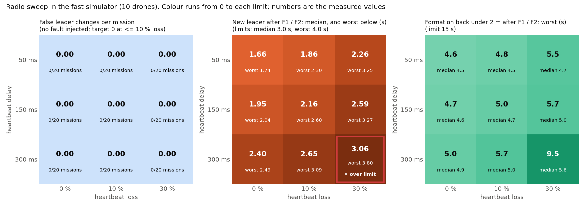

# Phase 5 — Radio realism (telemetry-like links)
Status: PASSED — the sweep passed in the fast simulator (540 runs) and on PX4 (18 missions with 10 drones,
28 September 2026). No leader changed without a real fault in any condition, and after the leader was killed
a new leader took over in 1.6–2.5 s on PX4 (limit 3 s).

## Acceptance criteria
- [PASS] Sweep the heartbeat link: delay {50, 150, 300} ms x loss {0, 10, 30} %.
  - Fast simulator: nine conditions, each with 20 missions without a fault, 20 with the leader killed (F1)
    and 20 with the leader's radio cut (F2), 540 runs (`reports/logs/phase_5_fastsim/radio_sweep.jsonl`).
  - PX4 with 10 drones: every condition once without a fault and once with the leader killed, 18 missions
    (`reports/logs/phase_5/d<delay>_l<loss>_{none,F1}/`).
- [PASS] Results table and plot: the tables below and `reports/phase5_radio_sweep.png`.
- [PASS] Worst condition where the Phase 4 criteria still hold.
  - Fast simulator: **300 ms at 10 % loss** (new leader median / worst 2.65 / 3.09 s, formation back within
    5.71 s) and **150 ms at 30 % loss** (2.59 / 3.27 s, 5.67 s). Only 300 ms with 30 % loss fails: median
    3.06 s against 3.0 s (worst 3.80 s, within 4.0 s).
  - PX4: all nine conditions held, including 300 ms with 30 % loss (new leader 2.30 s, formation back 6.05 s).
    With one leader kill per condition there is no median, so the fast simulator's result above is the
    limit to quote.
- [PASS] Zero false failovers at <= 10 % loss: 0 leader changes without a fault in 120 fast-simulator missions
  (and 0 in the 60 at 30 % loss), and 0 in the 9 PX4 missions without a fault (including the three at 30 %
  loss). Never more than one leader at a time on PX4. Closest pair 6.44 m or more in every run.

## PX4 results (10 drones, 28 September 2026)
From the trial logs by `scripts/phase4_metrics.py` (new leader, formation back, closest pair) and each run's
`metrics.json` (leader changes, leaders at the same time, goal). A mission without a fault has exactly one
leader change: the first election on the ground.

| Delay (ms) | Loss (%) | Without a fault: false leader changes | Leader killed: new leader (s) | Formation < 2 m (s) | Closest pair (m), both runs | Goal, both runs |
|---|---|---|---|---|---|---|
| 50 | 0 | 0 | 1.59 | 4.69 | 8.18 | 2/2 |
| 50 | 10 | 0 | 2.35 | 6.54 | 7.86 | 2/2 |
| 50 | 30 | 0 | 1.95 | 5.50 | 8.13 | 2/2 |
| 150 | 0 | 0 | 1.78 | 5.23 | 8.14 | 2/2 |
| 150 | 10 | 0 | 1.93 | 6.07 | 7.55 | 2/2 |
| 150 | 30 | 0 | 2.48 | 6.84 | 6.89 | 2/2 |
| 300 | 0 | 0 | 2.10 | 6.15 | 7.64 | 2/2 |
| 300 | 10 | 0 | 2.19 | 6.16 | 7.71 | 2/2 |
| 300 | 30 | 0 | 2.30 | 6.05 | 7.56 | 2/2 |

Limits: new leader 3.0 s median / 4.0 s worst, formation back within 15 s, closest pair >= 5 m. The table is
in `reports/logs/phase_5/phase5_px4_table.md`.

- 13 of the 18 missions ran on the charger, 5 on battery (the owner allows battery; `run_summary.json`,
  `power_before`). All passed either way.
- One attempt of `d50_l0_none` stopped when the mission watcher stalled for 60 minutes (a tooling fault, not
  a flight result). It is kept in `reports/logs/phase_5_incomplete/`, and the mission ran again and passed.

## Fast-simulator results (10 drones)
| Delay (ms) | Loss (%) | False leader changes (missions affected) | New leader median / worst (s) | Formation < 2 m median / worst (s) | Closest pair (m) | Goal | Phase 4 limits | No false change |
|---|---|---|---|---|---|---|---|---|
| 50 | 0 | 0 (0/20) | 1.66 / 1.74 | 4.47 / 4.59 | 8.23 | 60/60 | hold | yes |
| 50 | 10 | 0 (0/20) | 1.86 / 2.30 | 4.51 / 4.85 | 8.23 | 60/60 | hold | yes |
| 50 | 30 | 0 (0/20) | 2.26 / 3.25 | 4.72 / 5.55 | 6.82 | 60/60 | hold | yes |
| 150 | 0 | 0 (0/20) | 1.95 / 2.04 | 4.61 / 4.74 | 8.23 | 60/60 | hold | yes |
| 150 | 10 | 0 (0/20) | 2.16 / 2.60 | 4.70 / 5.05 | 8.23 | 60/60 | hold | yes |
| 150 | 30 | 0 (0/20) | 2.59 / 3.27 | 4.95 / 5.67 | 6.44 | 60/60 | hold | yes |
| 300 | 0 | 0 (0/20) | 2.40 / 2.49 | 4.92 / 5.04 | 8.24 | 60/60 | hold | yes |
| 300 | 10 | 0 (0/20) | 2.65 / 3.09 | 5.03 / 5.71 | 8.24 | 60/60 | hold | yes |
| 300 | 30 | 0 (0/20) | 3.06 / 3.80 | 5.56 / 9.47 | 7.68 | 60/60 | FAIL | yes |

## How it was measured
- `scripts/radio_sweep.py` runs the fast simulator (`src/swarm_tools/puresim.py`) with the real agent code
  for every drone. Its radio model delays every heartbeat on every link by the given delay and drops each one
  independently with the given loss; no jitter, like the PX4 sweep.
- **False leader change:** a new leader (a new drone or a new term) after the swarm has taken off, in a
  mission where nothing failed. The first election on the ground does not count.
- **New leader (F1, F2):** from the fault until every drone still flying follows the same new leader
  (`scripts/puresim_faults.py`, the same definition as the Phase 4 fast-simulator table).
- **Formation back:** from the fault until the formation error is below 2 m again.
- Limits: Phase 4's (new leader median 3.0 s and worst 4.0 s; formation back within 15 s; closest pair
  >= 5 m; goal in >= 9 of 10 runs) and Phase 5's (no false failover at <= 10 % loss).

## Sources verified
- The sweep grid and the criteria: `docs/SPECIFICATION.md`, Phase 5.
- The radio model: `Network` in `src/swarm_tools/puresim.py` (per-link delay, jitter and loss) and the PX4
  path's `src/swarm_tools/link_emulator.py`, which applies the same settings to the ROS 2 heartbeat topics
  (`scripts/run_mission.py --latency-ms --loss-pct`).

## Problems and fixes
- The first draft of the figure marked the 300 ms / 30 % cell "over limit" while showing the worst value
  (3.36 s, within the 4.0 s limit) instead of the median that failed; the panel now shows the median, with
  the worst value underneath.

## Known limitations / honest caveats
- **The PX4 sweep is small:** one mission without a fault and one leader kill per condition, so it confirms the
  fast simulator but cannot give a median or worst case per condition. The fast simulator gives those, with
  point-mass physics instead of PX4's.
- **Only the heartbeat link is degraded here.** Each drone's own autopilot link stays perfect; a drone whose
  autopilot link is a telemetry radio is Phase 6.
- **Independent packet loss.** Real radios lose packets in bursts (interference, range); bursts would stretch
  the time to a new leader more than the same average loss spread evenly.
- **No jitter** in this sweep; the scaling test (`reports/SCALING.md`) covers 10 % loss with 150 ms delay and
  30 ms jitter.

## Next phase: what is needed from the user
Nothing for Phase 5. Phase 6 runs the leader-kill and radio-cut faults with drone 1 behind a telemetry-radio
stand-in.
